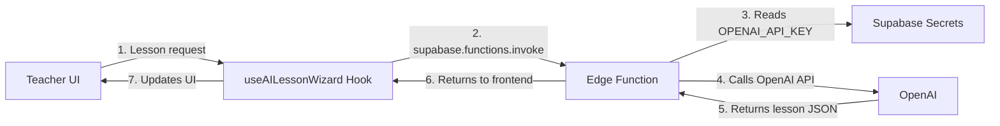

# AI Lesson Generator Setup

## Environment Variables Architecture

The AI Lesson Generator uses a **two-tier environment variable system**:

### Frontend (React/Vite)
- **Source**: `.env` file in project root
- **Variables**:
  - `VITE_SUPABASE_URL` - Your Supabase project URL
  - `VITE_SUPABASE_PUBLISHABLE_KEY` - Public API key for client-side operations
  - `VITE_GOOGLE_API_KEY` - Google API key (if using Google services)
- **Access**: Via `import.meta.env.VITE_*` in client-side code
- **Security**: These are build-time variables, safe to expose to client

### Edge Functions (Deno/Supabase)
- **Source**: Supabase Secrets (encrypted, server-side only)
- **Variables**:
  - `OPENAI_API_KEY` - OpenAI API key for lesson generation
  - `SUPABASE_ANON_KEY` - Auto-provided by Supabase
  - `SUPABASE_URL` - Auto-provided by Supabase
  - `SUPABASE_SERVICE_ROLE_KEY` - Auto-provided by Supabase
- **Access**: Via `Deno.env.get()` in edge functions
- **Security**: Never exposed to client, encrypted at rest

## Setup Instructions

### 1. Frontend Configuration
Ensure your `.env` file has:
```env
VITE_SUPABASE_URL=https://your-project-id.supabase.co
VITE_SUPABASE_PUBLISHABLE_KEY=your-anon-key-here
VITE_GOOGLE_API_KEY=your-google-api-key
```

### 2. Edge Function Secrets
Add `OPENAI_API_KEY` to Supabase:

1. Go to Supabase Dashboard
2. Navigate to: **Project Settings → Edge Functions → Secrets**
3. Add new secret:
   - Name: `OPENAI_API_KEY`
   - Value: Your OpenAI API key (starts with `sk-`)

## How It Works



### Data Flow
1. **Teacher fills wizard** → Component state
2. **Click "Generate"** → Calls `useAILessonWizard.generateLesson()`
3. **Hook invokes edge function** → Uses Supabase client from `.env`
4. **Edge function reads secret** → `Deno.env.get('OPENAI_API_KEY')`
5. **Calls OpenAI** → Generates lesson plan
6. **Returns AILesson JSON** → Parsed and displayed

## File Structure

```
/
├── .env                          # Frontend env vars (committed to repo, public keys only)
├── .env.local                    # (Optional) Local overrides (gitignored, never use for secrets)
├── src/
│   ├── hooks/
│   │   └── useAILessonWizard.ts  # Frontend hook
│   ├── components/
│   │   └── lesson/
│   │       └── AIGenerationWizard.tsx
│   ├── integrations/
│   │   └── supabase/
│   │       └── client.ts          # Reads VITE_* from .env
│   └── types/
│       └── aiLesson.ts            # AILesson TypeScript interface
└── supabase/
    └── functions/
        └── ai-lesson-generator/
            └── index.ts           # Edge function (reads OPENAI_API_KEY from secrets)
```

## Security Best Practices

### ✅ Do:
- Store `OPENAI_API_KEY` in Supabase secrets
- Use `.env` for frontend public keys (`VITE_*`)
- Access secrets via `Deno.env.get()` in edge functions
- Keep `.env` in version control (public keys only)

### ❌ Don't:
- Store secrets in `.env` or `.env.local`
- Commit `.env.local` to Git
- Access `OPENAI_API_KEY` from frontend
- Use `import.meta.env` for secrets in edge functions

## Testing

1. **Verify edge function deployment**:
   ```bash
   # Check Supabase Dashboard → Edge Functions
   # Should see: ai-lesson-generator (deployed)
   ```

2. **Test from UI**:
   - Navigate to `/teacher/lesson-builder`
   - Click "AI Generator" tab
   - Fill in lesson details
   - Click "Generate Lesson"
   - Check browser console for errors

3. **Check edge function logs**:
   - Supabase Dashboard → Edge Functions → ai-lesson-generator → Logs
   - Look for: "Generating AI lesson" and "OpenAI response received"

## Troubleshooting

### Error: "OpenAI API key not configured"
- **Cause**: `OPENAI_API_KEY` not set in Supabase secrets
- **Fix**: Add it in Supabase Dashboard → Edge Functions → Secrets

### Error: "Failed to start stream" / 404
- **Cause**: Edge function not deployed
- **Fix**: Push code to trigger deployment, or deploy manually

### Error: "Failed to parse lesson data"
- **Cause**: OpenAI returned invalid JSON
- **Fix**: Check edge function logs for raw response

### Frontend can't connect to Supabase
- **Cause**: Missing or incorrect `.env` values
- **Fix**: Verify `VITE_SUPABASE_URL` and `VITE_SUPABASE_PUBLISHABLE_KEY`

## Cost Estimation

Using `gpt-4o-mini`:
- **Input**: ~$0.00015 per 1K tokens
- **Output**: ~$0.0006 per 1K tokens
- **Typical lesson**: 500-1000 input tokens, 2000-3000 output tokens
- **Cost per lesson**: ~$0.002-0.003 (less than half a cent)

## Upgrading to GPT-4

To use a more powerful model, edit `supabase/functions/ai-lesson-generator/index.ts`:

```typescript
// Change this line:
model: 'gpt-4o-mini',

// To:
model: 'gpt-4o',
```

**Note**: GPT-4 costs ~10-20x more than GPT-4o-mini.
